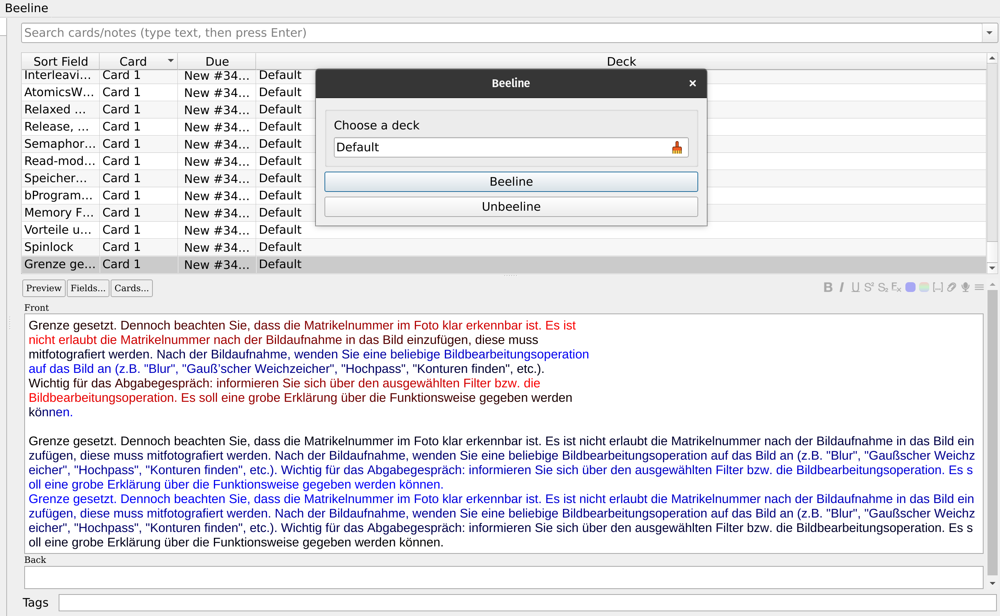

# Anki-beeline
Anki 2.1 add-on that adds gradients to text to make it easier to read.

 
## Install
Get it from [Ankiweb](https://ankiweb.net/shared/info/1776000188) or clone this repository to your addons directory.
